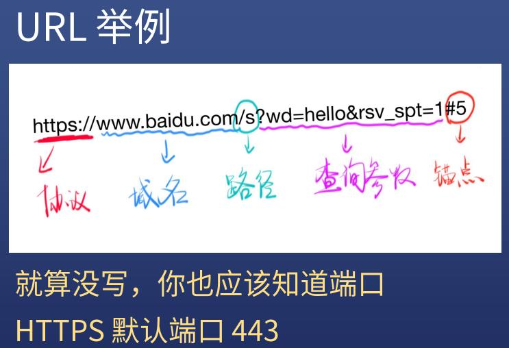

# IP

WWW=URL+HTTP+HTML
区别外网和内网

## 几个特殊的 IP

127.0.0.1 表示自己；localhost 通过 hosts 指定为自己；0.0.0.0 不表示任何设备；

## 端口 port

<pre>
<a href="https://zh.wikipedia.org/wiki/TCP/UDP%E7%AB%AF%E5%8F%A3%E5%88%97%E8%A1%A8#0.E5.88.B01023.E5.8F.B7.E7.AB.AF.E5.8F.A3">端口列表</a></pre>

0-1023 号端口给系统用的；
IP 和端口缺一不可

## 域名（IP 的别称）

ping baidu.com
作用：域名和 IP 通过 DNS 对应起来；分为顶级域名(com)二级域名(baidu)三级域名(www)

## URL

<pre>
URL包含：协议、域名、路径、查询参数、锚点；
协议:<a href="https://zh.wikipedia.org/wiki/%E8%B6%85%E6%96%87%E6%9C%AC%E4%BC%A0%E8%BE%93%E5%8D%8F%E8%AE%AE#%E5%8D%8F%E8%AE%AE%E6%A6%82%E8%BF%B0
">维基百科</a>
域名:简单说是一个IP地址的代码，目的是为了便于记忆后者。例如baidu.com是一个域名，我们就可以直接访问baidu.com来代替IP地址，然后DNS就会把它转成便于机器识别的IP地址。即不需要记住IP数字而是记住baidu.com
路径：<pre>
绝对路径也可称完整路径，是指向文件系统中某个固定位置的路径，不会因当前的工作目录而产生变化。为做到这点，它必须包括根目录。

相对路径则是以指定的工作目录作为基点，避开提供完整的绝对路径。档案名称就可以被视为以指定工作目录为基点的一个相对路径（虽然一般不将其称之为路径）</pre>
查询参数：以“?”字符为起点，每个参数以“&”隔开，再以“=”分开参数名称与资料
锚点：这个页面的某个部分/某个片段

</pre>
注意：锚点是无法在Network面板上看到，且不会传给服务器。

## curl

curl 可以发 HTTP 请求
curl -v http://baidu.com
