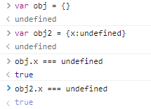
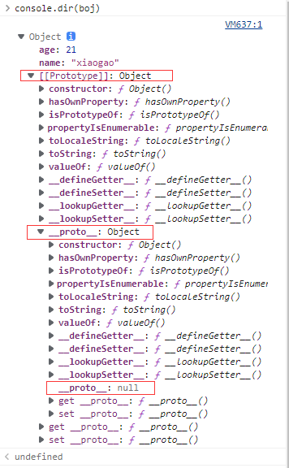

# 对象
## 七种数据类型
number string bool symbol null undefined object对象
## 五个Falsy值
null undefined NaN '' 0 
## 对象
1. 定义：没有顺序的数据集合，键值对的集合
2. 写法
    ```
    let obj = { 'name': 'frank', 'age': 18 }
    let obj = new Object({'name': 'frank'})
    console.log({ 'name': 'frank, 'age': 18 })
    ```
    注意：键名(name)是字符串，不是标识符，可以包含任意字符；引号('')可以省略，但是特殊字符不能省略，省略之后就只能写标识符（不以数字开头的）；<strong>就算引号省略了，键名也还是字符串</strong>
3. 属性名：每个key都是对象的属性名property；        
   属性值：每个value都是对象的属性值
4.  奇怪的属性名
    所有属性名会自动变成字符串(Object.keys(obj) 可以得到 obj 的所有 key)
    ```
    let obj = {
    1: 'a',
    3.2: 'b',
    1e2: true,
    1e-2: true,
    .234: true,
    0xFF: true
    };
    Object.keys(obj)
    =>["1", "100", "255", "3.2", "0.01", "0.234"]
    ```
5. 变量作属性名
    ```
    let p1 = 'name'
    let obj = { p1 : 'frank'}   //这样写，属性名为 'p1'
    let obj = { [p1] : 'frank' }    //这样写，属性名为 'name'
    ```
    注意：不加 [ ] 的属性名会自动变成字符串；加了 [ ] 则会当做变量求值；值如果不是字符串，则会自动变成字符串
6. 对象的隐藏属性       
    JS每一个对象都有一个隐藏属性，储藏着其共有属性组成的对象的地址，叫做原型，即为隐藏属性储藏着原型的地址。
    ```
    var obj = {}
    obj.toString() // 居然不报错,因为其原型有toString
    ```
7. 超纲知识
    ```
    let a = Symbol()
    let obj = { [a]: 'Hello' }
    ```
## 增删查改
1. 删除属性
    ```
    delate obj.xxxx
    delate obj['xxxx']
    ```
    查询是否还在
    ```
    'xxxx'in obj
    =>false
    ```
    undefined是有属性名 但是值为undefined，而delate是直接删除 不含属性名        
    不能通过 obj.xxx === undefined 来判断'xxx'是否为obj的属性       
     

2. 查看属性
    查看自身所有的属性名：Object.keys(xxxx)     
    查看自身所有的属性值：Object.values(xxxx)       
    查看自身所有的属性名与值：Object.entries(xxxx)      
    查看自身+共有属性（[[Prototype]]: Object）：console.dir     
    判断一个属性是自身的还是共有的：obj.hasOwnProperty('toString')      
    两种方法查看属性
    ```
    中括号语法：obj['key']
    点语法：obj.key   //注意：key没有带引号 仍是字符串
    ```
3. <strong>原型</strong>     
    
    每个对象都有原型，原型里面存着对象的共有属性，obj._proto_存着这个对象的地址，这个对象里面也有toString/constructor等属性     
    对象的原型也有原型，包含所有对象的共有属性，是对象的根，是null     
     
4. name 与 'name'       
    obj.name 等价于 obj['name'] 不等价于 obj[name]  //name是字符串，而不是变量      
    ```
    let name = 'xiaogao' 
    ```
    obj[name]等价于obj['xiaogao'] //可以理解为''字符串里面是常量 name为变量
5. 修改或增加属性（写）     
    直接赋值
    ```
    let obj = {name: 'frank'} // name 是字符串
    obj.name = 'frank' // name 是字符串
    obj['name'] = 'frank' 
    obj[name] = 'frank' // 错，因 name 值不确定
    obj['na'+'me'] = 'frank'
    let key = 'name'; obj[key] = 'frank'
    let key = 'name'; obj.key = 'frank' // 错
    因为 obj.key 等价于 obj['key']
    ```
    批量赋值的代码：
    ```
    Object.assign(obj, {age: 18, gender: 'man'})
    ```
    注意：无法通过自身修改或增加共有属性，例如obj和obj2：
    ```
    let obj = {}, obj2 = {} // 共有 toString
    obj.toString = 'xxx' 只会在改 obj 自身属性
    obj2.toString 未曾改变还是在原型上
    ```
    如果需要更改原型的属性（尽量不要更改）
    ```
    Object.prototype.toString = 'xxx'
    ```
    修改隐藏属性（要改的话一开始就改）
    ```
    let obj = Object.create(common)
    obj.name = 'frank'
    ```


    


