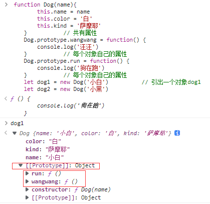
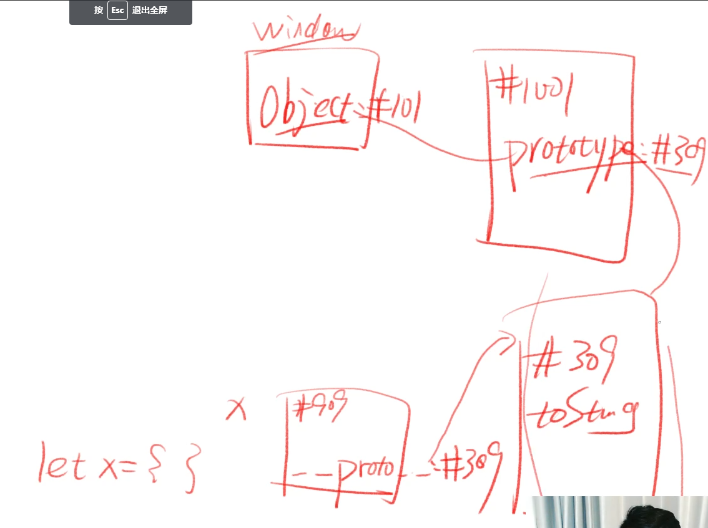

# 对象分类
## 利用构造函数来计算正方形面积

构造函数即为构造一个能够创造出对象的函数：
```
    let squareList = []
    let widthList = [5,6,5,6,5,6,5,6,5,6,5,6]

    function createSquare(width){       // 1. 声明 createSquare 一个函数
        let obj = Object.create(createSquare.squarePrototype) // 先使用后定义？NO 因为 createSquare 是在最后的代码中才执行
        obj.width = width
        return obj
    }
    createSquare.squarePrototype = { // 2. 把原型放到函数上,结合更加紧密
        getArea(){  
            return this.width * this.width 
        },
        getLength(){
            return this.width * 4
        },              // 3. 两个共有属性
        constructor: createSquare // 4. 方便通过原型找到构造函数（将构造函数放到原型上面）
    }
    for(let i = 0; i<12; i++){
        squareList[i] = createSquare(widthList[i])
        console.log(squareList[i].constructor) 
        // constructor 可以知道谁构造了这个对象：你妈是谁？
    }
```
简化，使用new  <strong>每个函数都有 prototype 属性，每个 prototype 都有 constructor 属性，也是故意的 </strong>
```
    let squareList = []
    let widthList = [5,6,5,6,5,6,5,6,5,6,5,6]
    function Square(width){ 
        this.width = width      // 自身函数添加自身属性
    }
    Square.prototype.getArea = function(){    // 函数是具有 prototype 属性的， ".getArea" 是为了在prototype上在增加一个属性，添加新对象的共有属性
        return this.width * this.width 
    }
    Square.prototype.getLength = function(){
        return this.width * 4
    }
    for(let i = 0; i<12; i++){
        squareList[i] = new Square(widthList[i])
        console.log(squareList[i].constructor)
    }
```
## new X( )的作用:       

    自动创建空对象      
    自动为空对象关联原型，原型地址指定为 X.prototype        
    自动将空对象作为 this 关键字运行构造函数            
    自动 return this   
    构造函数X：     
    X 函数本身负责给对象本身添加属性        
    X.prototype 对象负责保存对象的共用属性  
       
## 例子

```
    function Dog(name){
        this.name = name
        this.color = '白'
        this.kind = '萨摩耶'
    }           // 共有属性
    Dog.prototype.wangwang = function() {
        console.log('汪汪')
    }           // 增加原型prototype中的共有属性（函数）
    Dog.prototype.run = function() {
        console.log('狗在跑')       
    }           // 增加原型prototype中的共有属性（函数）
    let dog1 = new Dog('小白')          // 引出一个对象dog1
    let dog2 = new Dog('小黑')          // 引出一个对象dog1
    dog1            //打出dog1的属性
    dog2            //打出dog2的属性
```
生成的结果是：
    =>

## 代码规范

1. 所有构造函数（专门用于创建对象的函数）首字母（Dog）大写；所有被构造出来的对象(dog1)，首字母小写
2. new 后面的函数，使用名词形式，如 new Person()、new Object()      
其他函数，一般使用动词开头，如 createSquare(5)、createElement('div')

## 重要公式

<strong>对象（dog）.__proto__ === 构造函数（Dog）.prototype</strong>
```
let x = {}
x.__proto__ === window.Object.prototype
=>true
```
Q1:x的原型是什么？ x.__proto__的是值什么？      
答：是 Object.prototype     
Q2:画出内存图：x的proto指向#309，#309来自于prototype，prototype又来自于Object，Object又存在于window


Q3:Object.prototype 是哪个函数构造出来的？不知道。原型没有。Object.prototype.__proto__？为null

## 如何画圆
```
    function Circle(radius){
        this.radius = radius
    }
    Circle.prototype.getLength = function () {
        return this.radius * 2 * Math.PI
    }
    Circle.prototype.getArea = function () {
        return Math.pow(this.radius,2) * Math.PI
    }
    let c1 = new Circle(10)
    c1.radius => 10
    c1.getArea() => 
    c1.getLength() =>
``` 
```
    function Rect (width, height) {
        this.width = width
        this.height = height
    }
    Rect.prototype.getArea = function() {
        return this.width * this. height
    }
    Rect.prototype.getLength = function() {
        return (this.width + this. height ) * 2
    }
    let r1 = new Rect (2 , 3)
```
## 对象需要分类吗？类型与类
1. 需要分类；      
2. 类型是JS数据的分类，有七种 四基两空一对象
3. 类是针对于对象的分类，有无数种如：Array Function Date等
   
## 数组对象
1. 定义一个数组：
```
let arr = [1,2,3]
let arr = new Array(1,2,3)   // 元素为1，2，3
let arr = new Array(3)    // 长度为3
```
2. 数组对象的自身属性
    '0'/'1'/'2'/'length'        
    注意：属性名没有数字，只有字符串
3. 数组对象的共有属性

## 函数对象
1. 定义一个函数
``` 
let fn = new Function('x','y','return x+y')
```
2. 自身属性:        
    'name'/'length'
3. 共有属性
## E6 6 引入了新语法 （class统治天下）
用到在学


